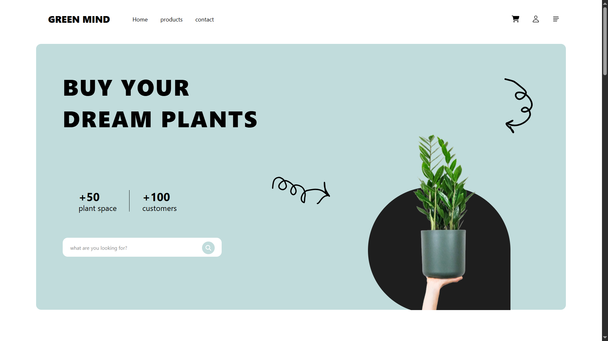

# 🌟 React E-commerce Application 🛍️
The React E-commerce Application is a comprehensive web application built using React, Vite, and Tailwind CSS. It provides a robust and scalable platform for managing e-commerce operations, including user authentication, product management, and order processing. The application is designed to be highly customizable and extensible, making it an ideal solution for businesses of all sizes.

## 🚀 Features
* User authentication and authorization
* Product management with categorization and filtering
* Order processing with payment gateway integration
* Responsive design with mobile and tablet support
* Customizable themes and layouts
* Support for multiple languages and currencies

## 🛠️ Tech Stack
* Frontend: React, Vite, Tailwind CSS
* Backend: Node.js, Express.js
* Database: MongoDB
* Authentication: JSON Web Tokens (JWT)
* Payment Gateway: Stripe
* Testing: Jest, Enzyme
* Deployment: Vercel

## 📦 Installation
To get started with the React E-commerce Application, follow these steps:
1. Clone the repository using `git clone https://github.com/your-repo/react-ecommerce-app.git`
2. Install the dependencies using `npm install` or `yarn install`
3. Start the development server using `npm run dev` or `yarn dev`
4. Open your web browser and navigate to `http://localhost:3000`

## 💻 Usage
To use the React E-commerce Application, follow these steps:
1. Register a new account by clicking on the "Sign Up" button
2. Log in to your account using the credentials you created
3. Browse the product catalog and add items to your cart
4. Proceed to checkout and complete the payment process
5. View your order history and track the status of your orders

## 📂 Project Structure

GreenMind
├─ eslint.config.js
├─ index.html
├─ package-lock.json
├─ package.json
├─ public
│  └─ assets
│     └─ img
│        ├─ c1.png
│        ├─ c2.png
│        ├─ c3.png
│        ├─ p1.png
│        ├─ p2.png
│        ├─ p3.png
│        ├─ person1.png
│        ├─ person2.png
│        └─ planet.png
├─ README.md
├─ ReadMeImages
│  └─ home.png
├─ src
│  ├─ App.css
│  ├─ components
│  │  ├─ AboutComponent.jsx
│  │  ├─ Footer.jsx
│  │  ├─ NavBar.jsx
│  │  ├─ ReviewCard.jsx
│  │  └─ SellingCard.jsx
│  ├─ index.css
│  ├─ main.jsx
│  └─ pages
│     ├─ AboutUs.jsx
│     ├─ Categories.jsx
│     ├─ Hero.jsx
│     ├─ HomePage.jsx
│     ├─ Proudect.jsx
│     ├─ Reviews.jsx
│     ├─ Root.jsx
│     └─ Selling.jsx
└─ vite.config.js

```

## 📸 Screenshots

## 🤝 Contributing
To contribute to the React E-commerce Application, please follow these steps:
1. Fork the repository using `git fork https://github.com/your-repo/react-ecommerce-app.git`
2. Create a new branch using `git branch feature/your-feature`
3. Commit your changes using `git commit -m "Your commit message"`
4. Push your changes using `git push origin feature/your-feature`
5. Create a pull request using the GitHub web interface

## 📝 License
The React E-commerce Application is licensed under the MIT License.

## 📬 Contact
For any questions or concerns, please contact us at [your-email@example.com](mailto:your-email@example.com).

## 💖 Thanks Message
Thanks for using the React E-commerce Application! This is written by [readme.ai](https://readme-generator-phi.vercel.app/).
```
